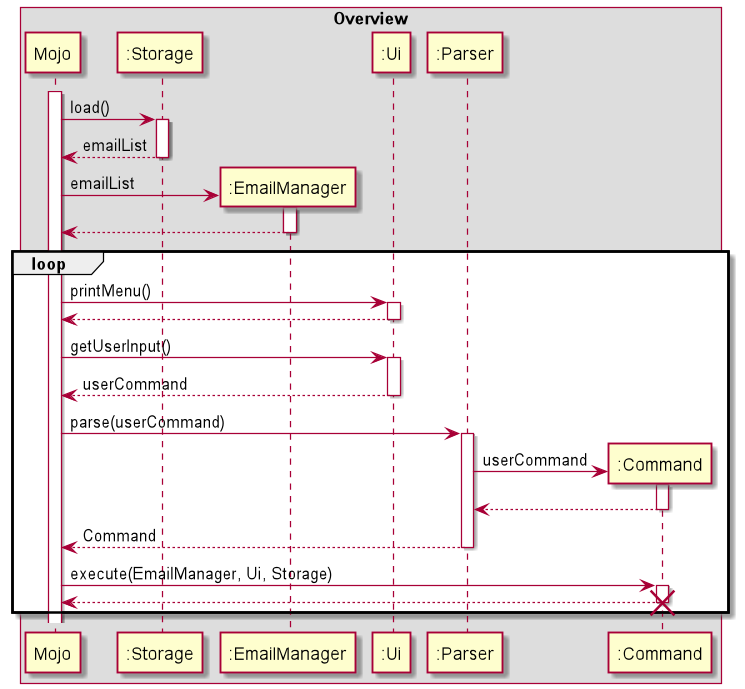

# Developer Guide

## Design

### Architecture


### Utilities Component
The Utilities component contains the main classes that run the main functions of Mojo.


The Utilities Class Diagram given above shows how the classes in the Utilities component interact with each other and classes from other component.

The Utilities Component consists for 3 classes.

* `Parser`: Breaks down user input into relevant objects.
* `Storage`: Reads data from, and writes data to, the local disk.
* `Ui`: Handles the input and output of the application.


## implementation

{Describe the design and implementation of the product. Use UML diagrams and short code snippets where applicable.}



## Product scope
### Target user profile

{Describe the target user profile}

### Value proposition

{Describe the value proposition: what problem does it solve?}

## User Stories

|Version| As a ... | I want to ... | So that I can ...|
|--------|----------|---------------|------------------|
|v1.0|new user|see usage instructions|refer to them when I forget how to use the application|
|v2.0|user|find a to-do item by name|locate a to-do without having to go through the entire list|

## Non-Functional Requirements

{Give non-functional requirements}

## Glossary

* *glossary item* - Definition

## Instructions for manual testing
{Give instructions on how to do a manual product testing e.g., how to load sample data to be used for testing}


### Finding emails by keyword
Print all emails that contains the keyword, and if there is no email contains the keyword, outputs `No matching emails found.`

Test case: `find subject 10`

Expected: 
````
1. [Deleted][UNREAD]
|| Subject: This is subject 10
|| From: 21312@gmail.com --> To: [12312@gmail.com]
|| Time: 2021-02-20T15:30:00
|| Tags: []
````

Test case: `find school`

Expected: `No matching emails found.`


##Resetting the password
Reset the password for the user's email account.
The program will aks for the old password from user. 

If the old password is correct, the program will ask for the new password from user and outputs`Your password has changed successfully!`

The number of wrong attempt is 3. 
If the old password is wrong for 3 times, the program will output `Sorry your old password is wrong. Please try again!(0 times left!)` and back to main menu.

###Test case 1: Typing wrong old password for 3 times

Input: `reset`

Expected: `Please enter your old password:`

Input: `12312`

Expected: `Sorry your old password is wrong. Please try again!(2 times left!)`

Input: `12222`

Expected: `Sorry your old password is wrong. Please try again!(1 times left!)`

Input: `12223`

Expected: `Sorry your old password is wrong. Please try again!(0 times left!)`

###Test case 2: Typing old password correctly

Input: `reset`

Expected: `Please enter your old password:`

Input: `5678`

Expected: `Please enter your new password:`

Input: `1234`

Expected: `Your password has changed successfully!`

Then, you can exit the program and use the new password to login.


