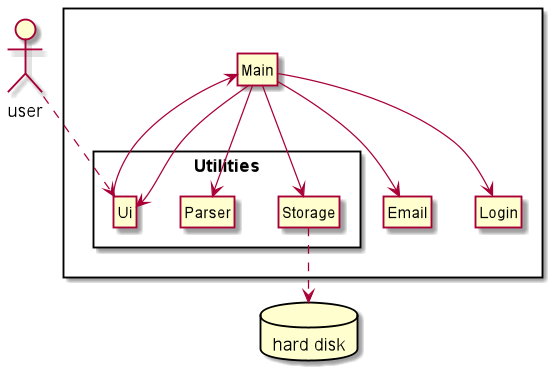
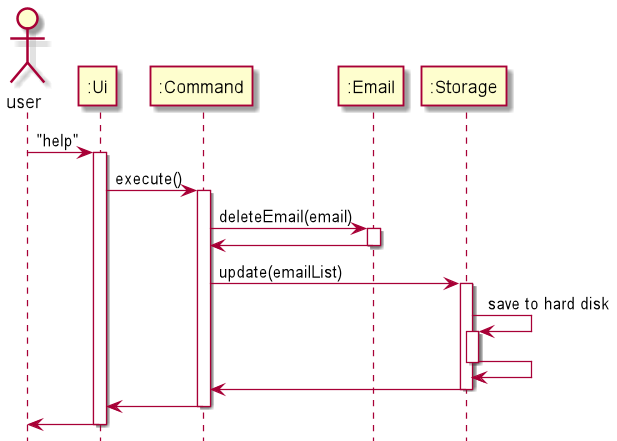
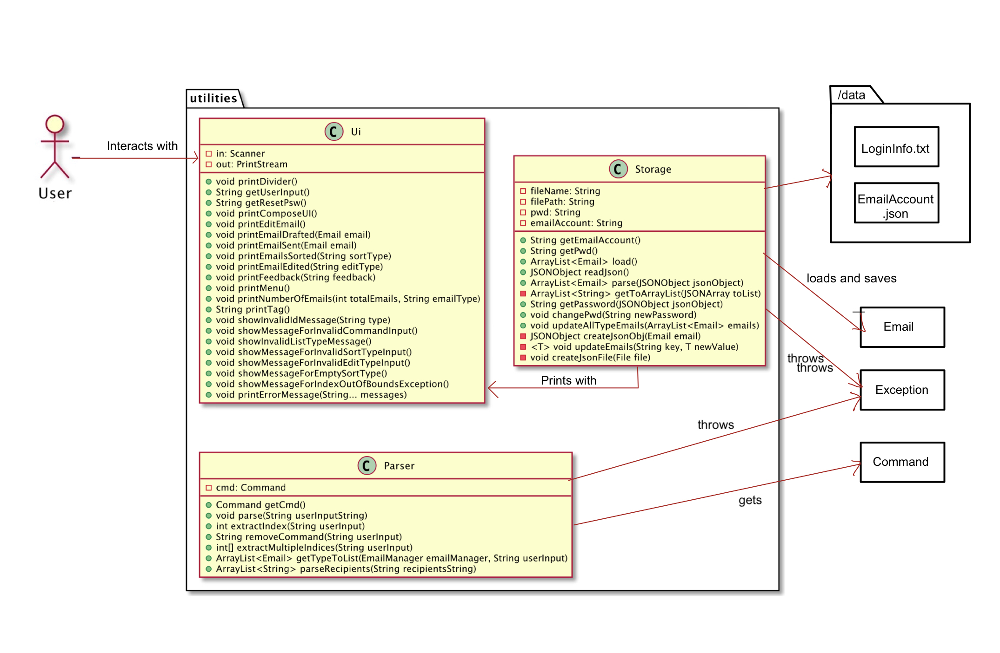
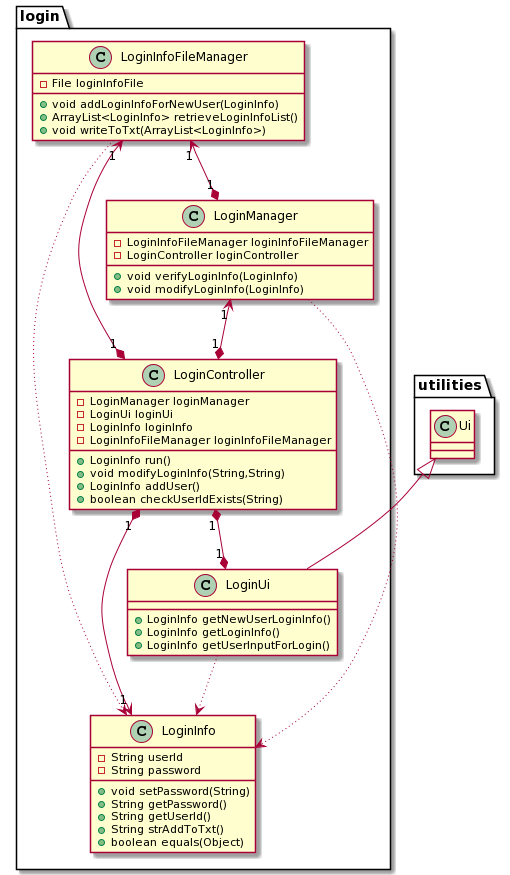
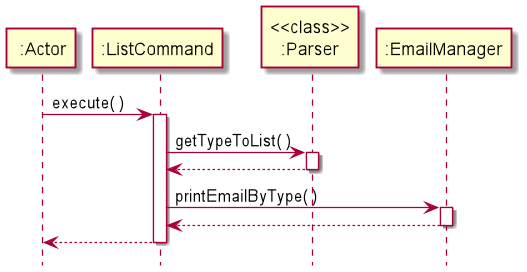
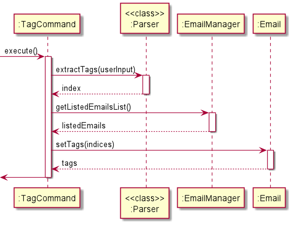

# Developer Guide

## Design

### Architecture

The Architecture Diagram above gives an overview of the different components in the application. 
Details of the individual components are given below.  

Mojo class controls the overall logic for the application. 
It is responsible for 
* At app launch: Initializes the components in the correct sequence, and connects them up with each other.
* At shut down: Shuts down the components and invokes cleanup methods where necessary.

The rest of the App consists of 4 components:
* Login: Links the user to their account.
* Email: Stores and manages the user's email.
* Utilities: Consists of Ui, Storage and Parser helper class. Ui interacts with the user. Storage reads data from, and writes data to the hard disk. Parser parse user's input into instructions that can be understood by the application.
* Command: In charge of executing the user's request.

For these four components,
* The Login component exposes its functionality through the LoginController class.
* The Email component exposes its functionality through the EmailManager class
* The Utilities component consists of Ui, Storage and Parser classes.
* The Command component exposes its functionality through different command classes that inherit from a base Command class.

**How the architecture components interact with each other**

The Sequence Diagram above shows how the components interact with each other for a command.
1. `Mojo` uses the `LoginController` to get the user's userID and password.
2. `Mojo` sends the user's info to the `Storage`, which will retrieve the existing emails from hard disks.
3. `Mojo` updates the `EmailManager` with the retrieved emails
4. `Mojo` gets the user's input from `Ui`
5. `Mojo` sends the input to `Parser` which then return the respective `Command` class according to user's input
6. `Mojo` executes the command.

***Due to a limitation of PlantUML, the lifeline did not end at the end of the destroy marker**

### Utilities Component
The Utilities component contains the main classes that run the main functions of Mojo.



The Utilities Class Diagram given above shows how the classes in the Utilities component interact with each other and classes from other component.

The Utilities Component consists for 3 classes.

* `Parser`: Breaks down user input into relevant objects.
* `Storage`: Reads data from, and writes data to, the local disk.
* `Ui`: Handles the input and output of the application.


### Login Component
The login component consists of the classes that run the main functions of the Login user Interface

The **Login Class Diagram** give above shows how the classes in the Login Component interact with each other

The Login Component consists of 5 components.
* <code> LoginController </code> The LoginController handles the login process and control logic of the login process.
* <code> LoginManager </code> The LoginManager provides the logic to verify the user login details
* <code> LoginUi </code> The LoginUi defines the display and gets input from the user. LoginUi extends the functionality of the Ui class
* <code> LoginInfo </code> The LoginInfo contains the atrributes and methods of each LoginInfo object from a particular user logging into MojoHR application
* <code> LoginInfoFileManager </code> The LoginInfoFileManager is responsible for the logic that handles the storage and retrieval of login information

## Implementation

### ListCommand 
There are seven variations of the <code> list </code> command.
1. List by All email(s)
2. List by Archived email(s) 
3. List by Deleted email(s)
4. List by Draft(s) email(s) 
5. List by Inbox email(s)
6. List by Junk email(s)
7. List by Sent email(s)

The sequence diagram shows how the <code> list(type) </code> operation work. 


### TagCommand
`TagCommand` allows the user to tag a specific email with the a number of tags.
1. `TagCommand` first finds out which email the user chose to be tagged by searching through the listedEmailList for the index given.
2. `TagCommand` will list the available tags that the users will choose from by calling `printTag()` on `Ui`
3. `TagCommand` then pass the user's input to the `parser` to extract the index
4. `TagCommand` sets the tag to the email through `EmailManager`
5. `TagCommand` updates the hard disk through `Storage`.

The sequence diagram shows how the <code> list(type) </code> operation work.



## Product scope

### Target user profile

{Describe the target user profile}

### Value proposition

{Describe the value proposition: what problem does it solve?}

## User Stories

|Version| As a ... | I want to ... | So that I can ...|
|--------|----------|---------------|------------------|
|v1.0|new user|see usage instructions|refer to them when I forget how to use the application|
|v2.0|user|find a to-do item by name|locate a to-do without having to go through the entire list|

## Non-Functional Requirements

{Give non-functional requirements}

## Glossary

* *glossary item* - Definition

## Instructions for manual testing
{Give instructions on how to do a manual product testing e.g., how to load sample data to be used for testing}


### Finding emails by keyword
Print all emails that contains the keyword, and if there is no email contains the keyword, outputs `No matching emails found.`

Test case: `find subject 10`

Expected: 
````
1. [Deleted][UNREAD]
|| Subject: This is subject 10
|| From: 21312@gmail.com --> To: [12312@gmail.com]
|| Time: 2021-02-20T15:30:00
|| Tags: []
````

Test case: `find school`

Expected: `No matching emails found.`


##Resetting the password
Reset the password for the user's email account.
The program will aks for the old password from user. 

If the old password is correct, the program will ask for the new password from user and outputs`Your password has changed successfully!`

The number of wrong attempt is 3. 
If the old password is wrong for 3 times, the program will output `Sorry your old password is wrong. Please try again!(0 times left!)` and back to main menu.

###Test case 1: Typing wrong old password for 3 times

Input: `reset`

Expected: `Please enter your old password:`

Input: `12312`

Expected: `Sorry your old password is wrong. Please try again!(2 times left!)`

Input: `12222`

Expected: `Sorry your old password is wrong. Please try again!(1 times left!)`

Input: `12223`

Expected: `Sorry your old password is wrong. Please try again!(0 times left!)`

###Test case 2: Typing old password correctly

Input: `reset`

Expected: `Please enter your old password:`

Input: `5678`

Expected: `Please enter your new password:`

Input: `1234`

Expected: `Your password has changed successfully!`

Then, you can exit the program and use the new password to login.


